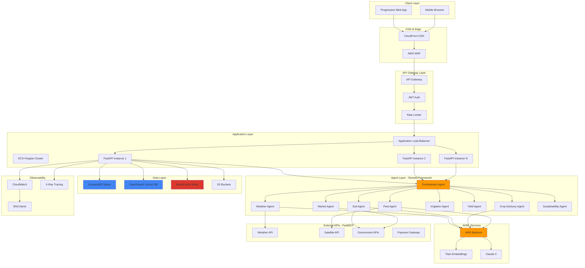
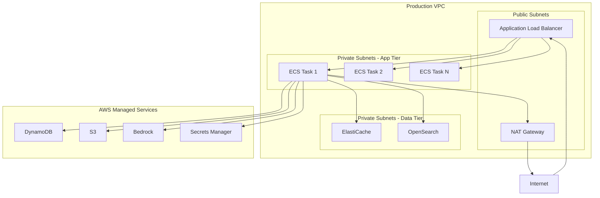
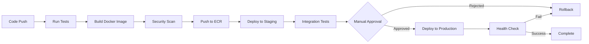
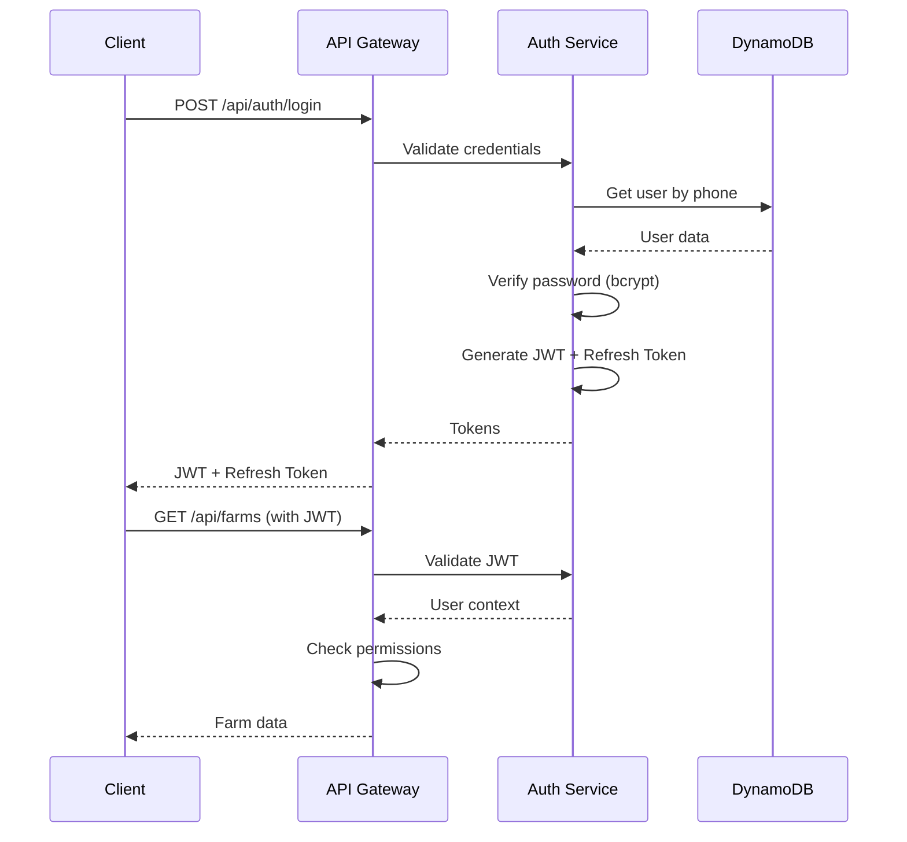

# Design Document: GramBrain AI Production Readiness

## Overview

The GramBrain AI platform is a multi-agent agricultural intelligence system designed to serve millions of farmers across India. The current MVP has a functional multi-agent architecture with basic API endpoints and frontend components, but requires significant production hardening to become market-ready.

This design transforms the hackathon MVP into a production-grade platform by implementing:

1. **Robust Data Layer**: Complete DynamoDB integration with optimized table design, proper indexing, and data access patterns
2. **AWS Service Integration**: Production-ready integration with Bedrock (LLM), S3 (file storage), OpenSearch (vector database), ElastiCache (Redis), and CloudWatch (monitoring)
3. **Security & Authentication**: JWT-based authentication, RBAC authorization, secrets management, and security hardening
4. **Observability**: Comprehensive logging, monitoring, distributed tracing, and alerting
5. **Deployment Infrastructure**: Docker containerization, CI/CD pipelines, infrastructure as code, and multi-environment setup
6. **Performance & Reliability**: Caching strategies, error handling, circuit breakers, graceful degradation, and load testing
7. **Frontend Production Features**: Optimized builds, error boundaries, PWA capabilities, and internationalization

The system maintains the existing Strands-based multi-agent architecture while adding production-grade infrastructure, monitoring, and operational capabilities.

## Architecture

### High-Level Architecture



### Deployment Architecture



## Components and Interfaces

### 1. API Layer (FastAPI)

**Responsibilities:**
- HTTP request handling and routing
- Request validation using Pydantic schemas
- Authentication and authorization middleware
- Rate limiting enforcement
- Error handling and standardized responses
- API versioning (v1, v2)
- OpenAPI documentation generation

**Key Interfaces:**
```python
# Authentication Middleware
class JWTAuthMiddleware:
    async def __call__(request: Request) -> User:
        """Validate JWT token and return authenticated user"""
        
# Rate Limiting Middleware
class RateLimitMiddleware:
    async def __call__(request: Request) -> None:
        """Enforce rate limits using Redis"""
        
# Error Handler
@app.exception_handler(Exception)
async def handle_exception(request: Request, exc: Exception) -> JSONResponse:
    """Standardized error response"""
```

### 2. Agent Layer (Strands Framework)

**Responsibilities:**
- Multi-agent orchestration and coordination
- Parallel agent execution with timeout handling
- Agent lifecycle management (initialization, shutdown)
- Message passing between agents
- LLM synthesis of agent outputs
- Agent registry and discovery

**Key Interfaces:**
```python
class OrchestratorAgent(Agent):
    async def analyze(query: Query, context: UserContext) -> AgentOutput:
        """Coordinate specialized agents and synthesize recommendation"""
        
class Agent(ABC):
    @abstractmethod
    async def analyze(query: Query, context: UserContext) -> AgentOutput:
        """Analyze query and generate recommendation"""
        
    async def call_llm(prompt: str, temperature: float, max_tokens: int) -> str:
        """Call AWS Bedrock LLM"""
        
    async def retrieve_rag_context(query_text: str, top_k: int) -> List[str]:
        """Retrieve relevant knowledge from vector database"""
```

### 3. Data Access Layer

**Responsibilities:**
- DynamoDB CRUD operations with proper error handling
- Query optimization using GSIs and projection expressions
- Batch operations for efficiency
- Data validation and transformation
- Connection pooling and retry logic

**Key Interfaces:**
```python
class DynamoDBRepository:
    async def get_item(table: str, key: Dict) -> Optional[Dict]:
        """Get single item with exponential backoff retry"""
        
    async def query(table: str, key_condition: str, index: str) -> List[Dict]:
        """Query with pagination support"""
        
    async def batch_write(table: str, items: List[Dict]) -> None:
        """Batch write with automatic chunking"""
        
class UserRepository(DynamoDBRepository):
    async def create_user(user: User) -> User:
    async def get_user(user_id: str) -> Optional[User]:
    async def update_user(user_id: str, updates: Dict) -> User:
    
class FarmRepository(DynamoDBRepository):
    async def create_farm(farm: Farm) -> Farm:
    async def get_farm(farm_id: str) -> Optional[Farm]:
    async def list_user_farms(user_id: str) -> List[Farm]:
```

### 4. LLM Client (AWS Bedrock)

**Responsibilities:**
- AWS Bedrock API integration
- Model selection and routing (Claude 3, Titan)
- Prompt template management
- Token usage tracking and cost monitoring
- Response validation and parsing
- Circuit breaker for fault tolerance

**Key Interfaces:**
```python
class BedrockClient:
    async def invoke(
        prompt: str,
        model_id: str,
        temperature: float,
        max_tokens: int
    ) -> str:
        """Invoke Bedrock model with retry and circuit breaker"""
        
    async def invoke_with_fallback(
        prompt: str,
        primary_model: str,
        fallback_model: str
    ) -> str:
        """Invoke with automatic fallback"""
        
    def track_usage(model_id: str, input_tokens: int, output_tokens: int) -> None:
        """Track token usage for cost monitoring"""
```

### 5. RAG System (Vector Database)

**Responsibilities:**
- Knowledge chunk storage and retrieval
- Embedding generation using Bedrock Titan
- Semantic search with metadata filtering
- Index management and optimization
- Cache integration for frequent queries

**Key Interfaces:**
```python
class RAGClient:
    async def add_knowledge(
        chunk_id: str,
        content: str,
        metadata: Dict
    ) -> None:
        """Add knowledge chunk with embedding"""
        
    async def search(
        query: str,
        top_k: int,
        filters: Dict
    ) -> List[SearchResult]:
        """Semantic search with metadata filtering"""
        
class OpenSearchVectorDB:
    async def index_document(doc_id: str, embedding: List[float], metadata: Dict) -> None:
    async def knn_search(query_embedding: List[float], k: int, filter: Dict) -> List[Dict]:
```

### 6. Cache Layer (Redis)

**Responsibilities:**
- Response caching with TTL
- Rate limit tracking
- Session storage
- Distributed locking
- Cache invalidation strategies

**Key Interfaces:**
```python
class CacheClient:
    async def get(key: str) -> Optional[str]:
    async def set(key: str, value: str, ttl: int) -> None:
    async def delete(key: str) -> None:
    async def increment(key: str, amount: int, ttl: int) -> int:
        """For rate limiting"""
```

### 7. Storage Layer (S3)

**Responsibilities:**
- File upload and download
- Presigned URL generation
- Lifecycle policy management
- CloudFront integration
- Multipart upload for large files

**Key Interfaces:**
```python
class S3Client:
    async def upload_file(
        bucket: str,
        key: str,
        file: bytes,
        content_type: str
    ) -> str:
        """Upload file and return URL"""
        
    async def generate_presigned_url(
        bucket: str,
        key: str,
        expiration: int
    ) -> str:
        """Generate presigned URL for secure access"""
```

### 8. External API Integration (FastMCP)

**Responsibilities:**
- Weather API integration (IMD, OpenWeather)
- Satellite imagery integration (Sentinel-2)
- Government database integration (Agmarknet)
- Payment gateway integration (Razorpay)
- Retry logic and fallback handling

**Key Interfaces:**
```python
class WeatherAPIClient:
    async def get_current_weather(lat: float, lon: float) -> WeatherData:
    async def get_forecast(lat: float, lon: float, days: int) -> List[WeatherData]:
    
class SatelliteAPIClient:
    async def get_ndvi_data(lat: float, lon: float, date: str) -> NDVIData:
    
class PaymentGatewayClient:
    async def create_order(amount: float, currency: str) -> Order:
    async def verify_payment(order_id: str, payment_id: str) -> bool:
```

### 9. Monitoring & Observability

**Responsibilities:**
- Structured logging with correlation IDs
- Metrics collection (latency, error rates, throughput)
- Distributed tracing with X-Ray
- Alert management via SNS
- Dashboard creation in CloudWatch

**Key Interfaces:**
```python
class Logger:
    def info(message: str, **context):
    def error(message: str, exception: Exception, **context):
    def with_correlation_id(correlation_id: str) -> Logger:
    
class MetricsClient:
    def record_latency(endpoint: str, duration_ms: float):
    def increment_counter(metric: str, tags: Dict):
    def record_gauge(metric: str, value: float):
```

## Data Models

### DynamoDB Table Design

#### Users Table
```
Table: grambrain-users-{env}
Partition Key: user_id (String)
Attributes:
  - phone_number (String)
  - name (String)
  - language_preference (String)
  - role (String)
  - created_at (String - ISO8601)
  - last_active (String - ISO8601)
  - metadata (Map)

GSI: phone-index
  - Partition Key: phone_number
  - Projection: ALL
```

#### Farms Table
```
Table: grambrain-farms-{env}
Partition Key: farm_id (String)
Sort Key: owner_id (String)
Attributes:
  - location (Map: {lat: Number, lon: Number})
  - area_hectares (Number)
  - soil_type (String)
  - irrigation_type (String)
  - crops (List)
  - created_at (String)
  - updated_at (String)

GSI: owner-index
  - Partition Key: owner_id
  - Sort Key: created_at
  - Projection: ALL
```

#### Recommendations Table
```
Table: grambrain-recommendations-{env}
Partition Key: user_id (String)
Sort Key: timestamp (String - ISO8601)
Attributes:
  - recommendation_id (String)
  - query_id (String)
  - farm_id (String)
  - recommendation_text (String)
  - reasoning_chain (List)
  - confidence (Number)
  - agent_contributions (List)
  - language (String)

GSI: query-index
  - Partition Key: query_id
  - Projection: ALL
```

#### Products Table
```
Table: grambrain-products-{env}
Partition Key: product_id (String)
Attributes:
  - farmer_id (String)
  - farm_id (String)
  - product_type (String)
  - name (String)
  - quantity_kg (Number)
  - price_per_kg (Number)
  - harvest_date (String)
  - images (List)
  - pure_product_score (Number)
  - status (String)
  - created_at (String)

GSI: farmer-index
  - Partition Key: farmer_id
  - Sort Key: created_at
  - Projection: ALL

GSI: type-score-index
  - Partition Key: product_type
  - Sort Key: pure_product_score
  - Projection: ALL
```

#### Knowledge Chunks Table
```
Table: grambrain-knowledge-{env}
Partition Key: chunk_id (String)
Attributes:
  - content (String)
  - source (String)
  - topic (String)
  - crop_type (String)
  - region (String)
  - embedding_indexed (Boolean)
  - created_at (String)

GSI: topic-index
  - Partition Key: topic
  - Sort Key: created_at
  - Projection: ALL
```

### OpenSearch Index Schema

```json
{
  "mappings": {
    "properties": {
      "chunk_id": {"type": "keyword"},
      "content": {"type": "text"},
      "embedding": {
        "type": "knn_vector",
        "dimension": 1536,
        "method": {
          "name": "hnsw",
          "space_type": "cosinesimil",
          "engine": "nmslib"
        }
      },
      "metadata": {
        "properties": {
          "source": {"type": "keyword"},
          "topic": {"type": "keyword"},
          "crop_type": {"type": "keyword"},
          "region": {"type": "keyword"},
          "created_at": {"type": "date"}
        }
      }
    }
  }
}
```

### S3 Bucket Structure

```
grambrain-assets-{env}/
├── user-uploads/
│   ├── {user_id}/
│   │   ├── profile-images/
│   │   └── farm-images/
├── product-images/
│   └── {product_id}/
├── satellite-data/
│   └── {farm_id}/
│       └── {date}/
└── knowledge-documents/
    └── {topic}/
```


## Correctness Properties

*A property is a characteristic or behavior that should hold true across all valid executions of a system-essentially, a formal statement about what the system should do. Properties serve as the bridge between human-readable specifications and machine-verifiable correctness guarantees.*

### Data Layer Properties

Property 1: DynamoDB write key consistency
*For any* data write operation to DynamoDB, the partition key and sort key (if applicable) should be set according to the table schema
**Validates: Requirements 1.2**

Property 2: DynamoDB retry with exponential backoff
*For any* DynamoDB operation that fails with a retryable error, the system should retry with exponential backoff up to 3 attempts before failing
**Validates: Requirements 1.4**

### LLM Integration Properties

Property 3: Bedrock fallback on failure
*For any* Bedrock API call that fails, the system should attempt fallback to an alternative model before returning an error
**Validates: Requirements 2.2**

Property 4: Token usage tracking
*For any* Bedrock API call, the system should record token usage (input and output tokens) for cost monitoring
**Validates: Requirements 2.3**

Property 5: Prompt template versioning
*For any* prompt template used, the system should store it in DynamoDB with a version identifier
**Validates: Requirements 2.4**

Property 6: Bedrock response validation
*For any* response received from Bedrock, the system should validate it against the expected schema before processing
**Validates: Requirements 2.5**

### Storage Properties

Property 7: S3 file organization
*For any* file uploaded to S3, the file should be stored in the correct bucket path based on file type and date
**Validates: Requirements 3.1**

Property 8: Presigned URL generation
*For any* file stored in S3, the system should be able to generate a presigned URL with configurable expiration time
**Validates: Requirements 3.2**

Property 9: File upload validation
*For any* file upload attempt, the system should validate file type, size, and content before accepting the upload
**Validates: Requirements 3.5**

### Vector Database Properties

Property 10: Embedding generation
*For any* knowledge chunk added to the system, an embedding should be generated using Bedrock Titan Embeddings
**Validates: Requirements 4.2**

Property 11: Embedding metadata inclusion
*For any* embedding stored in the vector database, metadata (crop type, region, topic) should be included for filtering
**Validates: Requirements 4.4**

Property 12: Vector DB fallback
*For any* semantic search request when the vector database is unavailable, the system should fallback to cached results or gracefully degrade
**Validates: Requirements 4.5**

### Agent Communication Properties

Property 13: Agent message serialization
*For any* message passed between agents, the message should be properly serialized and deserializable
**Validates: Requirements 5.2**

Property 14: Agent error recovery
*For any* agent that fails during execution, the system should handle the error and allow other agents to continue
**Validates: Requirements 5.4**

### External API Integration Properties

Property 15: FastMCP tool registration
*For any* FastMCP tool defined, it should be registered with a proper schema and validation rules
**Validates: Requirements 6.2**

Property 16: External API retry on failure
*For any* external API call that fails with a retryable error, the system should retry with backoff before failing
**Validates: Requirements 6.3**

Property 17: External API call logging
*For any* external API call made, the system should log the request and response for debugging
**Validates: Requirements 6.4**

Property 18: API rate limit backoff
*For any* external API call that hits rate limits, the system should implement backoff and queueing
**Validates: Requirements 6.5**

### Authentication Properties

Property 19: Password hashing with bcrypt
*For any* user registration, the password should be hashed using bcrypt with salt
**Validates: Requirements 7.1**

Property 20: JWT token generation
*For any* successful login, the system should issue a JWT token with 24-hour expiration and a refresh token
**Validates: Requirements 7.2**

Property 21: JWT token validation
*For any* API request with a JWT token, the system should validate the token and reject expired or invalid tokens
**Validates: Requirements 7.3**

Property 22: Role-based access enforcement
*For any* API request, the system should enforce role-based access control based on the user's role
**Validates: Requirements 7.4**

### Authorization Properties

Property 23: Resource ownership verification
*For any* resource access attempt, the system should verify the user owns the resource or has appropriate permissions
**Validates: Requirements 8.2**

Property 24: Role-based endpoint permissions
*For any* API endpoint call, the system should enforce role-based permissions through middleware
**Validates: Requirements 8.3**

Property 25: Permission denial response
*For any* failed permission check, the system should return 403 Forbidden with a clear error message
**Validates: Requirements 8.4**

### Rate Limiting Properties

Property 26: Rate limit exceeded response
*For any* request that exceeds rate limits, the system should return 429 Too Many Requests with Retry-After header
**Validates: Requirements 9.2**

Property 27: Tiered rate limiting
*For any* premium user, the system should apply higher rate limits based on their subscription tier
**Validates: Requirements 9.4**

Property 28: Rate limit violation alerts
*For any* repeated rate limit violations, the system should trigger alerts for potential abuse
**Validates: Requirements 9.5**

### Error Handling Properties

Property 29: Exception logging
*For any* exception that occurs, the system should catch and log it with full stack trace and context
**Validates: Requirements 10.1**

Property 30: Standardized error responses
*For any* error encountered, the system should return a standardized error response with an error code
**Validates: Requirements 10.3**

Property 31: Transient error retry
*For any* transient error, the system should retry with exponential backoff up to 3 attempts
**Validates: Requirements 10.4**

Property 32: Critical error alerts
*For any* critical error, the system should trigger alerts to on-call engineers via SNS
**Validates: Requirements 10.5**

### Logging and Monitoring Properties

Property 33: Structured logging with correlation IDs
*For any* request processed, the system should log with structured JSON format including correlation IDs
**Validates: Requirements 11.1**

Property 34: CloudWatch metrics emission
*For any* operation, the system should send relevant metrics (latency, error rates, throughput) to CloudWatch
**Validates: Requirements 11.2**

Property 35: Error logging with context
*For any* error, the system should log with ERROR level including user context and request details
**Validates: Requirements 11.3**

Property 36: X-Ray distributed tracing
*For any* request processed, the system should create X-Ray trace segments for distributed tracing
**Validates: Requirements 11.4**

### Distributed Tracing Properties

Property 37: Trace segment creation
*For any* request entering the system, an X-Ray trace segment should be created with a unique trace ID
**Validates: Requirements 12.1**

Property 38: Agent subsegment creation
*For any* agent invoked, a subsegment should be created in the X-Ray trace
**Validates: Requirements 12.2**

Property 39: External API trace inclusion
*For any* external API call, it should be included in the X-Ray trace segments
**Validates: Requirements 12.3**

Property 40: Trace annotation
*For any* trace collected, it should be annotated with user ID, farm ID, and query type for filtering
**Validates: Requirements 12.4**

### Caching Properties

Property 41: Redis caching with TTL
*For any* frequently accessed data, it should be cached in Redis with an appropriate TTL
**Validates: Requirements 13.1**

Property 42: Cache unavailability fallback
*For any* request when cache is unavailable, the system should fallback to the database without failing
**Validates: Requirements 13.5**

### Database Optimization Properties

Property 43: DynamoDB pagination
*For any* list operation on DynamoDB, the system should implement pagination with limit and LastEvaluatedKey
**Validates: Requirements 14.2**

### API Versioning Properties

Property 44: URL path versioning
*For any* API endpoint exposed, it should use URL path versioning with format /api/v1/resource
**Validates: Requirements 15.1**

Property 45: Deprecation warnings
*For any* deprecated API call, the system should return deprecation warnings in response headers
**Validates: Requirements 15.3**

Property 46: Unsupported version handling
*For any* call to an unsupported API version, the system should return 404 with upgrade guidance
**Validates: Requirements 15.5**

### Request Validation Properties

Property 47: Pydantic schema validation
*For any* API request received, the request body should be validated against Pydantic schemas
**Validates: Requirements 16.1**

Property 48: Validation error response
*For any* validation failure, the system should return 422 Unprocessable Entity with detailed field-level errors
**Validates: Requirements 16.2**

Property 49: Input sanitization
*For any* user input, the system should sanitize strings to prevent injection attacks
**Validates: Requirements 16.3**

Property 50: File upload validation
*For any* file upload, the system should validate file type, size, and content
**Validates: Requirements 16.4**

Property 51: Business rule validation
*For any* data validation, the system should enforce business rules like valid date ranges and numeric bounds
**Validates: Requirements 16.5**

### Security Properties

Property 52: XSS and injection prevention
*For any* user input accepted, the system should sanitize it to prevent XSS and SQL injection attacks
**Validates: Requirements 17.3**

Property 53: CORS configuration
*For any* API served, the system should configure CORS with specific allowed origins
**Validates: Requirements 17.4**

### Secrets Management Properties

Property 54: Secrets Manager retrieval
*For any* credential needed, the system should retrieve it from AWS Secrets Manager at runtime
**Validates: Requirements 18.1**

Property 55: Dynamic secret refresh
*For any* secret update, the system should refresh the secret without requiring application restart
**Validates: Requirements 18.2**

Property 56: Secret access audit logging
*For any* secret accessed, the system should log the access for audit trails
**Validates: Requirements 18.4**

Property 57: Secret value protection
*For any* secret used, the system should never log or expose the secret value
**Validates: Requirements 18.5**

### Container Properties

Property 58: Environment variable configuration
*For any* configuration value, it should be provided via environment variables rather than hardcoded
**Validates: Requirements 19.4**

### Health Check Properties

Property 59: Health check dependency verification
*For any* health check performed, the system should verify database connectivity, cache availability, and agent initialization
**Validates: Requirements 23.2**

Property 60: Unhealthy status response
*For any* health check when the system is unhealthy, it should return 503 Service Unavailable
**Validates: Requirements 23.3**

Property 61: Shutdown health status
*For any* system shutdown in progress, the health endpoint should return unhealthy status
**Validates: Requirements 23.5**

### Graceful Shutdown Properties

Property 62: SIGTERM request rejection
*For any* SIGTERM signal received, the system should stop accepting new requests
**Validates: Requirements 24.1**

Property 63: Resource cleanup on shutdown
*For any* system shutdown, database connections should be closed and resources released
**Validates: Requirements 24.3**

Property 64: Shutdown logging
*For any* system shutdown, the system should log the shutdown reason and duration
**Validates: Requirements 24.5**

### API Documentation Properties

Property 65: API documentation examples
*For any* API endpoint documented, the documentation should include request/response examples
**Validates: Requirements 30.3**

Property 66: API documentation completeness
*For any* API endpoint documented, the documentation should include authentication requirements and error codes
**Validates: Requirements 30.4**

Property 67: Automatic documentation updates
*For any* API change, the documentation should be updated automatically from code annotations
**Validates: Requirements 30.5**

## Error Handling

### Error Classification

Errors are classified into four categories:

1. **Client Errors (4xx)**: Invalid requests, authentication failures, authorization failures
2. **Server Errors (5xx)**: Internal errors, external service failures, database errors
3. **Transient Errors**: Temporary failures that can be retried (network timeouts, rate limits)
4. **Permanent Errors**: Failures that won't succeed on retry (invalid credentials, missing resources)

### Error Response Format

All errors follow a standardized JSON format:

```json
{
  "status": "error",
  "error_code": "INVALID_REQUEST",
  "message": "User-friendly error message",
  "details": {
    "field": "email",
    "reason": "Invalid email format"
  },
  "correlation_id": "abc-123-def",
  "timestamp": "2026-01-15T10:30:00Z"
}
```

### Retry Strategy

```python
class RetryConfig:
    max_attempts: int = 3
    base_delay_ms: int = 100
    max_delay_ms: int = 5000
    exponential_base: float = 2.0
    jitter: bool = True
    
def calculate_delay(attempt: int, config: RetryConfig) -> int:
    """Calculate delay with exponential backoff and jitter"""
    delay = min(
        config.base_delay_ms * (config.exponential_base ** attempt),
        config.max_delay_ms
    )
    if config.jitter:
        delay = delay * (0.5 + random.random() * 0.5)
    return int(delay)
```

### Circuit Breaker Pattern

```python
class CircuitBreaker:
    """Circuit breaker for external service calls"""
    
    states = ["CLOSED", "OPEN", "HALF_OPEN"]
    
    def __init__(
        self,
        failure_threshold: int = 5,
        timeout_seconds: int = 60,
        half_open_max_calls: int = 3
    ):
        self.failure_threshold = failure_threshold
        self.timeout_seconds = timeout_seconds
        self.half_open_max_calls = half_open_max_calls
        self.failure_count = 0
        self.last_failure_time = None
        self.state = "CLOSED"
    
    async def call(self, func, *args, **kwargs):
        """Execute function with circuit breaker protection"""
        if self.state == "OPEN":
            if self._should_attempt_reset():
                self.state = "HALF_OPEN"
            else:
                raise CircuitBreakerOpenError()
        
        try:
            result = await func(*args, **kwargs)
            self._on_success()
            return result
        except Exception as e:
            self._on_failure()
            raise e
```

### Graceful Degradation

When external services fail, the system degrades gracefully:

1. **Weather API Failure**: Use cached weather data (up to 6 hours old)
2. **Vector DB Failure**: Use cached search results or skip RAG context
3. **Bedrock Failure**: Return error with cached recommendations if available
4. **Redis Failure**: Continue without caching, direct database access
5. **S3 Failure**: Return error for uploads, serve cached URLs for downloads

## Testing Strategy

### Unit Testing

**Framework**: pytest with pytest-asyncio for async tests

**Coverage Target**: 80% code coverage for backend

**Test Organization**:
```
tests/
├── unit/
│   ├── test_agents/
│   │   ├── test_weather_agent.py
│   │   ├── test_soil_agent.py
│   │   └── test_orchestrator.py
│   ├── test_api/
│   │   ├── test_routes.py
│   │   ├── test_auth.py
│   │   └── test_validation.py
│   ├── test_data/
│   │   ├── test_repositories.py
│   │   └── test_models.py
│   └── test_llm/
│       ├── test_bedrock_client.py
│       └── test_prompt_templates.py
```

**Key Unit Tests**:
- Agent analysis logic with mocked LLM responses
- API endpoint request/response handling
- Data model validation and serialization
- Authentication and authorization logic
- Error handling and retry mechanisms
- Cache operations
- Database query construction

### Property-Based Testing

**Framework**: Hypothesis for Python

**Configuration**: Minimum 100 iterations per property test

**Test Tagging**: Each property-based test must include a comment with format:
```python
# Feature: production-readiness, Property 1: DynamoDB write key consistency
@given(st.from_type(User))
def test_dynamodb_write_keys(user: User):
    """Test that all DynamoDB writes use proper partition/sort keys"""
    # Test implementation
```

**Property Test Categories**:

1. **Data Integrity Properties**:
   - Round-trip serialization (DynamoDB, JSON, Pydantic)
   - Data validation rules
   - Key consistency

2. **Error Handling Properties**:
   - Retry behavior with various failure scenarios
   - Circuit breaker state transitions
   - Error response format consistency

3. **Security Properties**:
   - Password hashing verification
   - JWT token validation
   - Input sanitization effectiveness

4. **API Contract Properties**:
   - Request validation
   - Response format consistency
   - Version compatibility

**Example Property Tests**:

```python
from hypothesis import given, strategies as st

# Feature: production-readiness, Property 47: Pydantic schema validation
@given(st.dictionaries(st.text(), st.text()))
def test_request_validation_rejects_invalid(invalid_data: dict):
    """Any invalid request data should be rejected with 422"""
    response = client.post("/api/users", json=invalid_data)
    assert response.status_code == 422
    assert "errors" in response.json()

# Feature: production-readiness, Property 19: Password hashing with bcrypt
@given(st.text(min_size=8, max_size=100))
def test_password_hashing(password: str):
    """Any password should be hashed with bcrypt"""
    hashed = hash_password(password)
    assert hashed.startswith("$2b$")  # bcrypt prefix
    assert verify_password(password, hashed)
    assert not verify_password(password + "x", hashed)

# Feature: production-readiness, Property 21: JWT token validation
@given(st.text())
def test_jwt_validation_rejects_invalid(invalid_token: str):
    """Any invalid JWT token should be rejected"""
    with pytest.raises(InvalidTokenError):
        validate_jwt(invalid_token)
```

### Integration Testing

**Scope**: Test interactions between components

**Key Integration Tests**:
- End-to-end query processing through orchestrator and agents
- DynamoDB operations with real AWS SDK (using LocalStack)
- S3 file upload/download flows
- Redis caching integration
- External API mocking with responses library

### Load Testing

**Tool**: Locust for load testing

**Scenarios**:
1. **Baseline Load**: 100 concurrent users, 1000 requests/minute
2. **Peak Load**: 1000 concurrent users, 10000 requests/minute
3. **Stress Test**: Gradually increase to 5000 concurrent users

**Metrics to Track**:
- P50, P95, P99 latency
- Error rate
- Throughput (requests/second)
- Database query times
- LLM call latency
- Cache hit rate

### Security Testing

**Tools**:
- OWASP ZAP for vulnerability scanning
- Bandit for Python security linting
- Safety for dependency vulnerability checking

**Test Cases**:
- SQL injection attempts
- XSS attacks
- CSRF attacks
- Authentication bypass attempts
- Authorization escalation attempts
- Rate limit bypass attempts

## Deployment Strategy

### Environments

1. **Development**: Local development with Docker Compose
2. **Staging**: AWS environment mirroring production
3. **Production**: Multi-AZ deployment with auto-scaling

### CI/CD Pipeline



### Deployment Process

1. **Build Phase**:
   - Run unit tests and property tests
   - Build Docker image with multi-stage build
   - Scan image for vulnerabilities with Trivy
   - Push to Amazon ECR

2. **Staging Deployment**:
   - Deploy to staging ECS cluster
   - Run integration tests
   - Run smoke tests
   - Monitor for 15 minutes

3. **Production Deployment** (Blue-Green):
   - Deploy new version to "green" environment
   - Run health checks
   - Gradually shift traffic (10%, 25%, 50%, 100%)
   - Monitor error rates and latency
   - Automatic rollback if error rate > 1%

4. **Post-Deployment**:
   - Monitor CloudWatch metrics
   - Check X-Ray traces for errors
   - Verify log aggregation
   - Update deployment documentation

### Rollback Strategy

**Automatic Rollback Triggers**:
- Error rate > 1% for 5 minutes
- P95 latency > 10 seconds
- Health check failures > 50%
- Critical alerts from CloudWatch

**Manual Rollback**:
- Switch traffic back to "blue" environment
- Investigate issues in "green" environment
- Fix and redeploy

## Infrastructure as Code

### Terraform Structure

```
terraform/
├── modules/
│   ├── vpc/
│   ├── ecs/
│   ├── dynamodb/
│   ├── opensearch/
│   ├── elasticache/
│   ├── s3/
│   └── monitoring/
├── environments/
│   ├── dev/
│   ├── staging/
│   └── production/
└── main.tf
```

### Key Infrastructure Components

**VPC Configuration**:
- 3 Availability Zones
- Public subnets for ALB
- Private subnets for ECS tasks
- Private subnets for data tier (Redis, OpenSearch)
- NAT Gateway for outbound traffic

**ECS Fargate**:
- Auto-scaling based on CPU/memory
- Min: 2 tasks, Max: 20 tasks
- Target CPU utilization: 70%
- Health check grace period: 60 seconds

**DynamoDB**:
- On-demand billing mode
- Point-in-time recovery enabled
- Encryption at rest with KMS
- Global Secondary Indexes for queries

**OpenSearch**:
- 3-node cluster (1 master, 2 data nodes)
- Instance type: r6g.large.search
- EBS storage: 100GB per node
- Automated snapshots daily

**ElastiCache Redis**:
- Cluster mode enabled
- 3 shards with 1 replica each
- Instance type: cache.r6g.large
- Automatic failover enabled

## Monitoring and Alerting

### CloudWatch Dashboards

**API Dashboard**:
- Request count by endpoint
- P50, P95, P99 latency
- Error rate (4xx, 5xx)
- Active connections

**Agent Dashboard**:
- Agent invocation count
- Agent execution time
- Agent error rate
- LLM token usage

**Infrastructure Dashboard**:
- ECS task count
- CPU/memory utilization
- DynamoDB consumed capacity
- Redis cache hit rate
- OpenSearch cluster health

### Alerts

**Critical Alerts** (PagerDuty):
- Error rate > 1% for 5 minutes
- P95 latency > 10 seconds for 5 minutes
- ECS task failures > 3 in 5 minutes
- DynamoDB throttling > 10 requests/minute
- OpenSearch cluster RED status

**Warning Alerts** (Email):
- Error rate > 0.5% for 10 minutes
- P95 latency > 5 seconds for 10 minutes
- Cache hit rate < 70%
- Disk usage > 80%
- Cost anomalies detected

### Log Aggregation

**CloudWatch Logs Structure**:
```
/aws/ecs/grambrain-api-{env}
├── application.log
├── access.log
└── error.log
```

**Log Retention**:
- Development: 7 days
- Staging: 30 days
- Production: 90 days

**Log Sampling**:
- INFO logs: 10% sampling in production
- WARN logs: 100% retention
- ERROR logs: 100% retention

## Security Considerations

### Authentication Flow



### Security Best Practices

1. **Secrets Management**:
   - All secrets in AWS Secrets Manager
   - Automatic rotation every 90 days
   - No secrets in code or environment variables
   - Audit logging for secret access

2. **Network Security**:
   - VPC with private subnets
   - Security groups with least privilege
   - WAF rules for common attacks
   - DDoS protection with AWS Shield

3. **Data Encryption**:
   - TLS 1.3 for data in transit
   - KMS encryption for data at rest
   - Encrypted EBS volumes
   - Encrypted S3 buckets

4. **Access Control**:
   - IAM roles with least privilege
   - MFA for production access
   - Service-to-service authentication
   - Regular access reviews

5. **Compliance**:
   - GDPR compliance for data handling
   - Indian data protection laws
   - Regular security audits
   - Incident response procedures

## Performance Optimization

### Caching Strategy

**Cache Layers**:

1. **Application Cache** (Redis):
   - User sessions: 24 hours
   - Weather data: 3 hours
   - RAG search results: 24 hours
   - Farm data: 1 hour
   - Product listings: 30 minutes

2. **CDN Cache** (CloudFront):
   - Static assets: 1 year
   - Product images: 7 days
   - API responses (GET): 5 minutes

**Cache Invalidation**:
- Write-through for user updates
- TTL-based for external data
- Event-driven for product updates

### Database Optimization

**DynamoDB Best Practices**:
- Use composite keys for efficient queries
- Leverage GSIs for access patterns
- Batch operations for bulk writes
- Projection expressions to reduce data transfer
- Consistent reads only when necessary

**Query Patterns**:
```python
# Efficient: Query with partition key
farms = table.query(
    KeyConditionExpression=Key('owner_id').eq(user_id)
)

# Inefficient: Scan entire table
farms = table.scan(
    FilterExpression=Attr('soil_type').eq('loamy')
)

# Better: Use GSI
farms = table.query(
    IndexName='soil-type-index',
    KeyConditionExpression=Key('soil_type').eq('loamy')
)
```

### LLM Optimization

**Cost Reduction Strategies**:
1. **Prompt Caching**: Cache common prompts and responses
2. **Model Selection**: Use smaller models for simple tasks
3. **Batch Processing**: Combine multiple queries when possible
4. **Response Streaming**: Stream responses for better UX
5. **Token Limits**: Set appropriate max_tokens per use case

**Latency Reduction**:
1. **Parallel Agent Execution**: Run agents concurrently
2. **Timeout Management**: Set aggressive timeouts (10s per agent)
3. **Fallback Models**: Use faster models as fallbacks
4. **Prompt Optimization**: Reduce prompt size while maintaining quality

## Scalability Considerations

### Horizontal Scaling

**ECS Auto-Scaling**:
```hcl
resource "aws_appautoscaling_target" "ecs_target" {
  max_capacity       = 20
  min_capacity       = 2
  resource_id        = "service/${aws_ecs_cluster.main.name}/${aws_ecs_service.api.name}"
  scalable_dimension = "ecs:service:DesiredCount"
  service_namespace  = "ecs"
}

resource "aws_appautoscaling_policy" "ecs_policy" {
  name               = "scale-on-cpu"
  policy_type        = "TargetTrackingScaling"
  resource_id        = aws_appautoscaling_target.ecs_target.resource_id
  scalable_dimension = aws_appautoscaling_target.ecs_target.scalable_dimension
  service_namespace  = aws_appautoscaling_target.ecs_target.service_namespace

  target_tracking_scaling_policy_configuration {
    predefined_metric_specification {
      predefined_metric_type = "ECSServiceAverageCPUUtilization"
    }
    target_value = 70.0
  }
}
```

### Database Scaling

**DynamoDB**:
- On-demand mode for unpredictable traffic
- Provisioned mode with auto-scaling for predictable patterns
- Global tables for multi-region deployment

**OpenSearch**:
- Vertical scaling: Increase instance size
- Horizontal scaling: Add more data nodes
- Read replicas for query-heavy workloads

**Redis**:
- Cluster mode for horizontal scaling
- Read replicas for read-heavy workloads
- Automatic failover for high availability

### Cost Optimization

**Strategies**:
1. **Right-sizing**: Monitor and adjust instance sizes
2. **Reserved Capacity**: Use reserved instances for baseline load
3. **Spot Instances**: Use for non-critical workloads
4. **S3 Lifecycle**: Move old data to cheaper storage classes
5. **DynamoDB On-Demand**: Use for variable traffic patterns
6. **CloudWatch Log Sampling**: Reduce log volume in production

**Cost Monitoring**:
- Daily cost reports by service
- Budget alerts at 80% and 100%
- Cost anomaly detection
- Monthly cost optimization reviews

---

**Document Version**: 1.0  
**Last Updated**: January 2026  
**Status**: Ready for Task Planning  
**Owner**: GramBrain AI Engineering Team
